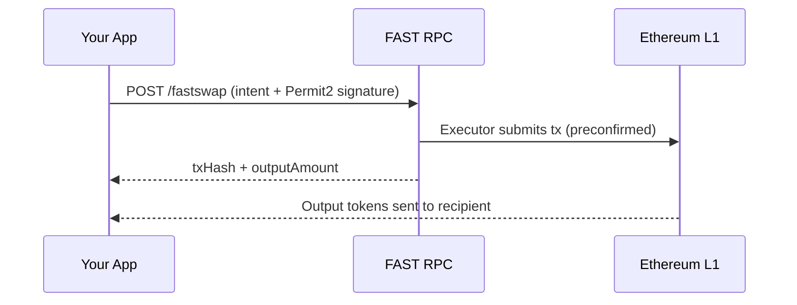
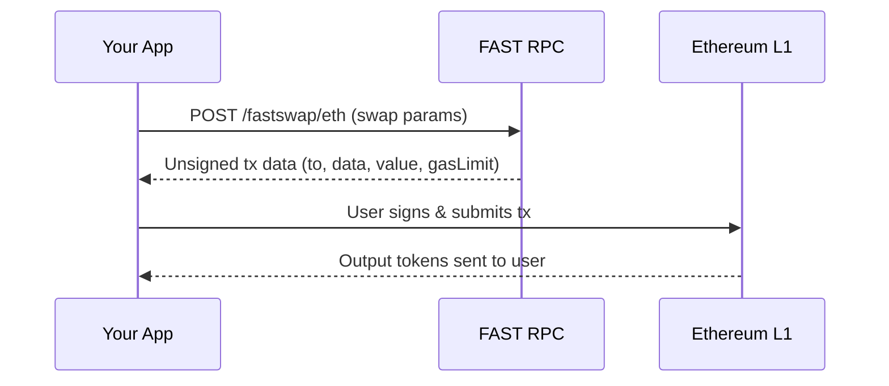
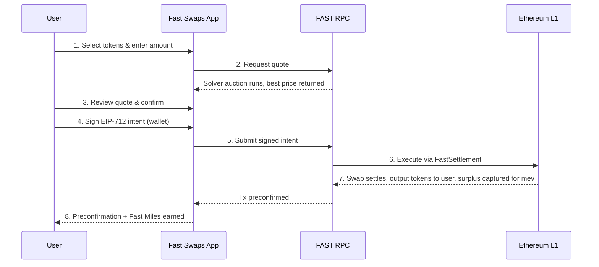

Fast Swaps is a swap interface built on top of [Fast Protocol](/v1.2.x/concepts/fast-protocol) that lets users trade tokens on Ethereum mainnet while earning mev rewards. Unlike traditional DEX frontends where mev is extracted from traders, Fast Swaps routes swaps through the [FAST RPC](/v1.2.x/get-started/fastrpc) and settles them via the **FastSettlement** smart contracts, redistributing captured mev back to users as **Fast Miles**.

<Card title="Launch Fast Swaps" icon="bolt" href="https://fastprotocol.io" horizontal>
  Start swapping at fastprotocol.io
</Card>

---

# How Fast Swaps Works

## Overview

When a user initiates a swap on Fast Swaps, the following happens:

1. The user selects tokens and enters an amount — a **solver auction** runs to find the best available price across liquidity sources
2. The user signs an **EIP-712 intent** (for ERC-20 tokens) or submits a direct transaction (for ETH)
3. [FAST RPC](/v1.2.x/get-started/fastrpc) picks up the signed intent and executes it through the **FastSettlement** contract on Ethereum
4. The winning solver routes the swap through the best available liquidity and the FastSettlement contract settles it on-chain
5. mev generated from the swap is captured by Fast Protocol and redistributed to the user as Fast Miles

The swap flow is designed to feel like any familiar DEX — select tokens, enter an amount, review the quote, confirm. The key difference is the settlement layer: instead of the user submitting a swap transaction directly to a DEX router, Fast Swaps uses an intent-based architecture where FAST RPC executes the trade on the user's behalf via a competitive solver auction.

---

## Execution Paths

Fast Swaps supports two execution paths depending on the input token:

| Input Token | Path | User Action | Gas |
| ----------- | ---- | ----------- | --- |
| **ERC-20** (e.g., USDC, DAI, WBTC) | Permit2 | Sign an off-chain EIP-712 message | No gas required from the user |
| **ETH** | Direct | Submit a transaction from wallet | User pays gas |

### ERC-20 Path (Permit2)

For ERC-20 token swaps, Fast Swaps uses [Uniswap's Permit2](https://docs.uniswap.org/contracts/permit2/overview) contract to enable gasless, signature-based token transfers.

<Steps>
  <Step title="One-time Permit2 approval">
    The first time you swap a given ERC-20 token, you must approve the Permit2 contract to spend that token. This is a standard ERC-20 `approve` transaction. If you've already approved the token for Permit2 on another application (like Uniswap), no additional approval is needed.
  </Step>
  <Step title="Sign the swap intent">
    For each swap, you sign an off-chain EIP-712 typed data message. This message encodes a `PermitWitnessTransferFrom` that includes:
    - The **token permission** (which token and how much FAST RPC can transfer)
    - A **witness** containing your `Intent` struct (input/output tokens, amounts, recipient, deadline, nonce)

    No gas is required for this step — it is only a signature.
  </Step>
  <Step title="FAST RPC executes the swap">
    FAST RPC receives your signed intent and calls `executeWithPermit` on the FastSettlement contract. The contract:
    1. Verifies your Permit2 signature
    2. Transfers your input tokens via Permit2
    3. Routes the swap through the solver's chosen liquidity path
    4. Sends the output tokens to your wallet
    5. Returns any surplus to the protocol for mev redistribution
  </Step>
</Steps>

### ETH Path

When swapping ETH as the input token, the user submits a transaction directly:

<Steps>
  <Step title="Submit the swap transaction">
    The user signs and broadcasts a transaction that calls `executeWithETH` on the FastSettlement contract, sending ETH along with the call.
  </Step>
  <Step title="Contract executes the swap">
    The FastSettlement contract wraps the ETH to WETH if needed, executes the swap through the DEX route, and sends the output tokens to the user's wallet.
  </Step>
</Steps>

<Info>
In both paths, the transaction is routed through FAST RPC, which enables mev-commit preconfirmations and mev capture.
</Info>

---

## Pricing & Quoting

Fast Swaps uses a **solver auction** to find the best price for each swap. When a user enters a swap amount, the system:

1. **Runs a competitive solver auction** — Multiple solvers compete to offer the best execution price across available liquidity sources. The winning solver's quote is presented to the user.

2. **Estimates gas costs** — Each quote includes a gas estimate so the user can see the total cost of the swap.

3. **Calculates price impact** — The difference between the quoted price and the mid-market price is displayed to the user. Price impact severity is color-coded:
   - **Green** — Less than 0.1% (negligible)
   - **Yellow** — 0.1% to 1% (moderate)
   - **Red** — Greater than 1% (significant)

4. **Refreshes every 15 seconds** — Quotes have a 15-second validity window. A countdown timer in the UI shows when the next refresh will occur. Users can also manually refresh at any time.

### Slippage Protection

Users can configure max slippage to protect against price movement between quoting and execution. The default is 0.5%, and users can set a custom percentage via the settings gear icon.

The max slippage is encoded into the `userAmtOut` (minimum output amount) field of the swap intent. If the swap would result in less than this minimum, the transaction reverts.

### Swap Deadline

Each swap intent includes a deadline timestamp. If FAST RPC does not execute the swap before this deadline, the intent expires and cannot be executed. The default deadline is 30 minutes.

---

## Smart Contracts

Fast Swaps is powered by smart contracts deployed on **Ethereum L1** (Chain ID: 1).

### FastSettlement V3

The core settlement contract that executes swaps on behalf of users.

| Property | Value |
| -------- | ----- |
| **Contract** | FastSettlementV3 (Upgradeable Proxy) |
| **Network** | Ethereum Mainnet (Chain ID: 1) |
| **Proxy Address** | [`0x084C0EC7f5C0585195c1c713ED9f06272F48cB45`](https://etherscan.io/address/0x084C0EC7f5C0585195c1c713ED9f06272F48cB45#code) |
| **Implementation Address** | [`0x9bc916d7cf71ac34e3d407d8ed8838071a3b6ebf`](https://etherscan.io/address/0x9bc916d7cf71ac34e3d407d8ed8838071a3b6ebf#code) |
| **Source** | [GitHub](https://github.com/primev/mev-commit) |

#### Functions

**`executeWithETH(intent, swapData)`**

Executes a swap where ETH is the input token. The user sends ETH with the transaction.

```solidity
function executeWithETH(
    Intent calldata intent,
    SwapCall calldata swapData
) external payable returns (uint256 received, uint256 surplus);
```

**`executeWithPermit(intent, signature, swapData)`**

Executes a swap where an ERC-20 token is the input. FAST RPC provides the user's Permit2 signature.

```solidity
function executeWithPermit(
    Intent calldata intent,
    bytes calldata signature,
    SwapCall calldata swapData
) external returns (uint256 received, uint256 surplus);
```

#### Data Structures

**Intent** — Encodes the user's swap parameters:

```solidity
struct Intent {
    address user;         // The user initiating the swap
    address inputToken;   // Token being sold
    address outputToken;  // Token being bought
    uint256 inputAmt;     // Amount of input token
    uint256 userAmtOut;   // Minimum output amount (slippage protection)
    address recipient;    // Address receiving the output tokens
    uint256 deadline;     // Unix timestamp after which the intent expires
    uint256 nonce;        // Permit2 nonce (prevents replay)
}
```

**SwapCall** — Encodes the DEX routing data:

```solidity
struct SwapCall {
    address to;    // Target DEX router contract
    uint256 value; // ETH value to send (if applicable)
    bytes data;    // Encoded swap calldata for the router
}
```

### Permit2

Fast Swaps uses Uniswap's canonical [Permit2](https://docs.uniswap.org/contracts/permit2/overview) contract for gasless ERC-20 approvals.

| Property | Value |
| -------- | ----- |
| **Contract** | Permit2 |
| **Network** | Ethereum Mainnet |
| **Address** | `0x000000000022D473030F116dDEE9F6B43aC78BA3` |
| **Source** | [GitHub](https://github.com/Uniswap/permit2) |

Permit2 allows users to approve a token once and then sign off-chain messages (EIP-712) for subsequent transfers. This eliminates the need for per-swap on-chain approval transactions.

---

## EIP-712 Signing

For ERC-20 swaps, Fast Swaps constructs an EIP-712 typed data message that combines a Permit2 transfer with a swap intent witness. The signing domain is:

```json
{
  "name": "Permit2",
  "chainId": 1,
  "verifyingContract": "0x000000000022D473030F116dDEE9F6B43aC78BA3"
}
```

The typed data includes:

- **PermitWitnessTransferFrom** — Standard Permit2 transfer with an additional witness field
- **TokenPermissions** — Specifies which token and amount FAST RPC can transfer
- **Intent** (witness) — The full swap parameters that the FastSettlement contract will verify on-chain

This design ensures FAST RPC can only execute the exact swap the user intended. The signature covers both the token transfer authorization and the swap parameters, preventing any modification of the swap terms after signing.

---

## Third-Party Integration

Wallets and dApps can integrate Fast Swaps directly via the FAST RPC HTTP API. Instead of building a full swap UI, you call two endpoints to get quotes and execute swaps on behalf of your users — with mev redistribution, preconfirmations, and gasless ERC-20 swaps included out of the box.

**Base URL:** `https://fastrpc.mev-commit.xyz`

### ERC-20 Swaps (Gasless)

For ERC-20 token swaps, users sign an off-chain EIP-712 Permit2 message and the FAST RPC executor submits the transaction on their behalf. The user pays no gas.

**Prerequisites:**
1. The user must have approved the [Permit2](https://docs.uniswap.org/contracts/permit2/overview) contract (`0x000000000022D473030F116dDEE9F6B43aC78BA3`) to spend the input token (one-time per token)
2. Your app must construct and have the user sign an EIP-712 `PermitWitnessTransferFrom` message that includes the swap `Intent` as a witness (see [EIP-712 Signing](#eip-712-signing) above for the full typed data structure)

#### `POST /fastswap`

**Request:**

```json
{
  "user": "0x...",          // User's wallet address
  "inputToken": "0x...",    // ERC-20 token being sold
  "outputToken": "0x...",   // Token being bought
  "inputAmt": "1000000",   // Amount in wei (string)
  "userAmtOut": "950000",   // Minimum output amount — slippage protection (string)
  "recipient": "0x...",     // Address to receive output tokens
  "deadline": "1700000000", // Unix timestamp — intent expires after this (string)
  "nonce": "0",             // Permit2 nonce (string)
  "signature": "0x...",     // EIP-712 Permit2 signature (hex)
  "slippage": "0.5"         // Optional: slippage % (default 0.5%)
}
```

**Response:**

```json
{
  "txHash": "0x...",         // Transaction hash
  "outputAmount": "955000",  // Expected output amount
  "gasLimit": 350000,        // Gas limit used
  "status": "success",       // "success" or "error"
  "error": ""                // Error details if status is "error"
}
```

### ETH Swaps (User-Submitted)

For native ETH swaps, the API returns unsigned transaction data that the user signs and submits themselves. The user pays gas.

#### `POST /fastswap/eth`

**Request:**

```json
{
  "outputToken": "0x...",             // ERC-20 token to receive
  "inputAmt": "1000000000000000000", // ETH amount in wei (string)
  "userAmtOut": "950000",            // Minimum output amount (string)
  "sender": "0x...",                 // User's wallet address
  "deadline": "1700000000",          // Unix timestamp (string)
  "slippage": "0.5"                  // Optional: slippage % (default 0.5%)
}
```

**Response:**

```json
{
  "to": "0x084C0EC7f5C0585195c1c713ED9f06272F48cB45", // FastSettlement contract
  "data": "0x...",            // Hex-encoded calldata
  "value": "1000000000000000000", // ETH to send (matches inputAmt)
  "chainId": 1,               // Ethereum mainnet
  "gasLimit": 400000,          // Estimated gas limit
  "status": "success",
  "error": ""
}
```

The user should construct a transaction from this response, sign it, and broadcast it to the network.

### Integration Flow

**ERC-20 path** — gasless, executor-submitted:



**ETH path** — user-submitted:



<Info>
For the ETH path, the user submits the transaction themselves. To get a preconfirmation, the signed transaction should be submitted through FAST RPC via `eth_sendRawTransaction` rather than a standard Ethereum RPC. See [FAST RPC Usage](/v1.2.x/get-started/fastrpc) for setup details.
</Info>

### Error Handling

Both endpoints return structured errors:
- **HTTP 400** — Invalid request (missing fields, malformed addresses, invalid amounts)
- **HTTP 405** — Wrong HTTP method (only POST is accepted)
- **HTTP 500** — Internal error (Barter API failure, transaction building failure)

When `status` is `"error"`, the `error` field contains a description of what went wrong. Common errors include:
- `"barter minReturn (...) < user required (...)"` — The best available price doesn't meet the user's minimum output. Suggest the user increase slippage or reduce the swap amount.
- `"executor dependencies not configured"` — Path 1 (ERC-20) is not enabled on this RPC instance.

---

## Supported Tokens

Fast Swaps supports over **2,400 ERC-20 tokens** on Ethereum mainnet. Any token with on-chain liquidity can be traded. The token list includes:

- **Major tokens**: ETH, WETH, USDC, USDT, DAI, WBTC
- **DeFi tokens**: UNI, AAVE, LINK, MKR, SNX, COMP
- **Meme tokens**: PEPE, SHIB, DOGE (wrapped)
- **Custom tokens**: Users can add any ERC-20 token by entering its contract address

<Warning>
Always verify the contract address when adding custom tokens. Fast Swaps does not verify the legitimacy of user-added tokens.
</Warning>

---

## Fast Miles

Users earn **Fast Miles** proportional to the mev their swaps generate through Fast Protocol. The mev distribution model is detailed in the [Fast Protocol Economics](/v1.2.x/concepts/fast-protocol) page.

Key points:
- Users receive **at least 90%** of the mev their transactions generate under normal conditions
- Fast Miles are tracked in the Fast Swaps dashboard and leaderboard
- Miles are planned to be tokenized — early users accumulate before the official points system launches
- Bonus miles are available through referrals and one-time tasks in the app

For a full explanation of mev distribution, fee parameters, and the adaptive parameter model, see [Fast Protocol](/v1.2.x/concepts/fast-protocol).

---

## Architecture Diagram

The following shows how a swap flows through the Fast Swaps system:



---

## Comparison with Traditional DEX Frontends

| Feature | Traditional DEX (e.g., Uniswap App) | Fast Swaps |
| ------- | ----------------------------------- | --------- |
| **Token selection** | User selects tokens | User selects tokens |
| **Pricing** | DEX router quote | Solver auction across liquidity sources |
| **Transaction submission** | User submits directly to public mempool | Intent signed off-chain, FAST RPC executes |
| **mev exposure** | User's swap is visible in mempool; bots can front-run/sandwich | Swap routed through FAST RPC; mev is captured and redistributed |
| **mev rewards** | None | User earns Fast Miles proportional to mev generated |
| **Gas for ERC-20 swaps** | User pays gas | FAST RPC pays gas (gasless for user) |
| **Settlement** | Direct DEX router call | FastSettlement contract with surplus capture |
| **Preconfirmations** | None | Transaction preconfirmed by Ethereum block builders on the mev-commit network |

---

## Security Considerations

- **Intent signing is non-custodial.** The user's wallet signs an EIP-712 message authorizing a specific swap with specific parameters. FAST RPC cannot modify the intent (tokens, amounts, recipient, deadline) after signing.
- **Permit2 nonces prevent replay.** Each signed intent uses a unique nonce from the Permit2 nonce bitmap. A used nonce cannot be reused.
- **Deadline enforcement.** Intents expire after the user-specified deadline. Stale intents cannot be executed.
- **Minimum output protection.** The `userAmtOut` field ensures the user receives at least the expected amount minus slippage tolerance. If the swap would produce less, the transaction reverts.
- **Smart contract audits.** The FastSettlement contracts are [open source](https://github.com/primev/mev-commit) and subject to security review.

---

## Quick Start

<CardGroup cols={2}>
  <Card title="What are Fast Swaps?" icon="circle-question" href="/v1.2.x/knowledge-base/what-are-fast-swaps">
    Quick FAQ for first-time users.
  </Card>
  <Card title="Fast Swaps Guide" icon="book-open" href="/v1.2.x/get-started/fast-swaps">
    Step-by-step guide to performing your first swap.
  </Card>
</CardGroup>
